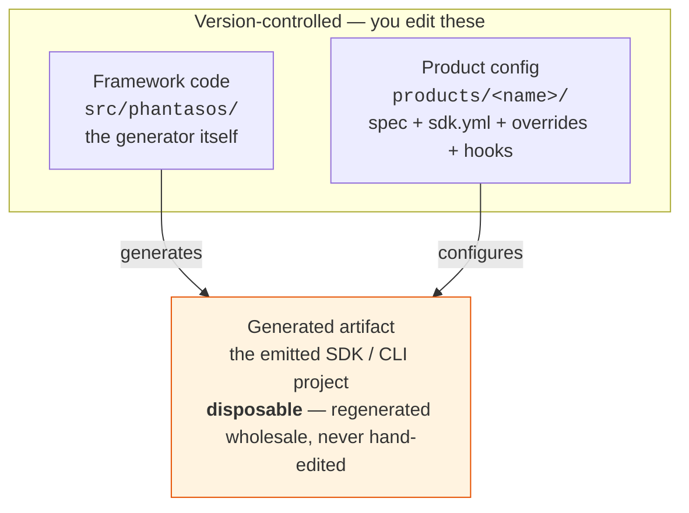
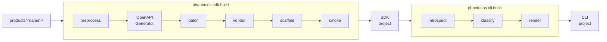

# Architecture

phantasos generates native, self-contained Python SDKs and command-line tools
from OpenAPI specs. It wraps [OpenAPI Generator](https://openapi-generator.tech/)
and adds generic spec preprocessing, codegen-bug patches, vendored components
(auth, pagination, errors, a resource facade), and a complete project scaffold —
so the output is a real, shippable package, not just `models/` and `api/`.

!!! note "Scope"
    The maintained target is **Palo Alto Networks products**, generated from their
    OpenAPI specs. The implementation is spec-agnostic (no PAN hard-coding) as an
    engineering convenience — not a promise to support arbitrary non-PAN specs.

## Two stages, one host CLI

phantasos is a two-stage generator driven by the `phantasos` command:

1. **`phantasos sdk build <product>`** turns an OpenAPI spec into a standalone
   Python SDK.
2. **`phantasos cli build <product>`** introspects that built SDK and emits a
   matching [Typer](https://typer.tiangolo.com/) + Rich CLI.

Each emitted project is standalone — it depends only on a small runtime set
(`urllib3`, `python-dateutil`, `pydantic`, `typing-extensions`) and carries its
own vendored component code. It does **not** import phantasos.

## Three layers

phantasos keeps three things strictly separate. Two are version-controlled and
yours to edit; the third is a disposable build output.

The only durable customization surfaces are `products/<name>/` and the shared
scaffold templates under `src/phantasos/scaffold/`. Everything in the generated
artifact is recreated on every build — so never hand-edit it.

## The build pipeline

Running the two commands moves a product through these stages:

- **preprocess** — generic + declarative spec transforms, then optional `hooks.py`.
- **OpenAPI Generator** — the upstream jar produces `models/` + `api/`.
- **patch** — codegen-bug fixes (lenient enums, oneOf handling), then optional `hooks.py`.
- **vendor** — render the selected components into `<package>/extras/`.
- **scaffold** — render the full project (pyproject, CI, docs, tests) with product overrides.
- **smoke** — import every module and count operations.

The CLI stage then **introspects** the built SDK, **classifies** its operations
into commands, and **renders** the Typer CLI.

To author a product and run these builds, see [Authoring a product](authoring.md).
For the command surface, see the [CLI reference](cli-reference.md).
