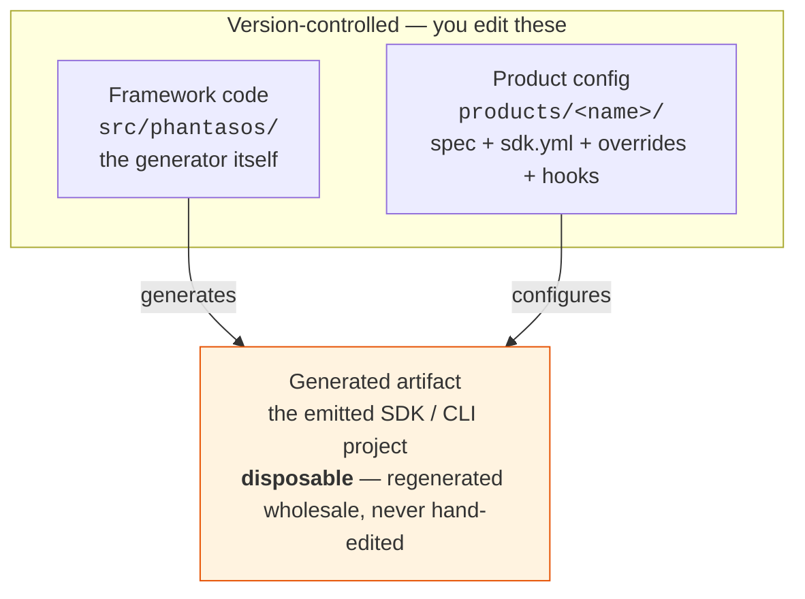
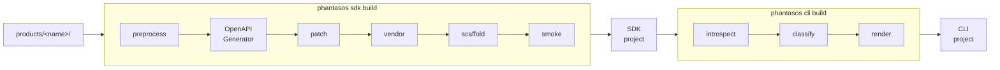

# User-facing mkdocs documentation (Set 1) Implementation Plan

> **For agentic workers:** REQUIRED SUB-SKILL: Use `subagent-driven-development` (recommended) or `executing-plans` to implement this plan task-by-task. Steps use checkbox (`- [ ]`) syntax for tracking.

**Goal:** Replace the thin/mismatched mkdocs site with a small, clean, maintainer-oriented set of four pages — Home, Architecture (intent + two Mermaid diagrams), Authoring a product (quickstart + lean reference), CLI reference — and remove the obsolete mkdocstrings API reference.

**Architecture:** Markdown content under `docs/`, published by mkdocs-material. Diagrams are Mermaid (rendered natively by material via a `pymdownx.superfences` custom fence — no new dependency). The deep mechanism lives in `.agents/context/` (agent-facing, not linked from the site); these pages are self-contained and distilled from `.agents/context/index.md` + `goals-non-goals.md`.

**Tech Stack:** mkdocs, mkdocs-material, pymdownx (superfences), Mermaid, uv (lockfile + run), nox (offline gate).

**Spec:** `docs/specs/2026-06-15-user-facing-docs-design.md` (the grilled contract — read it first).

---

## Conventions for every task

- This repo may sit on sshfs. Prefix `uv` commands with an explicit env dir if `.venv` symlinks fail:
  `UV_PROJECT_ENVIRONMENT=/tmp/phantasos-ufd uv run ...`. The examples below show the bare form; add the prefix if uv errors on the venv.
- "Evidence before assertions": every verification step shows the command **and** the expected output. Run it and read the output before checking the box.
- Commit after each task with the message shown. Work on branch `feature/user-facing-docs` (Task 0).
- Do **not** bump the version or touch `pyproject.toml`'s `version`. This is feature work → CHANGELOG `## [Unreleased]` only.

---

## File map

| File | Action | Responsibility |
|---|---|---|
| `docs/index.md` | rewrite | Home — landing + minimal two-command first-build + signposts |
| `docs/architecture.md` | create | Intent (+ Scope note) + overview + Diagram A + Diagram B |
| `docs/authoring.md` | rename from `AUTHORING_A_SPEC.md` + restructure | Quickstart on top, then complete config reference |
| `docs/cli-reference.md` | create | The 3 host commands + flags (terse) |
| `docs/reference.md` | delete | API ref removed |
| `docs/ONBOARDING.md` | delete (after merge) | Walkthrough folded into `authoring.md` |
| `mkdocs.yml` | modify | nav → 4 pages; drop mkdocstrings plugin; add Mermaid fence |
| `pyproject.toml` | modify | drop `mkdocstrings[python]` from `docs` deps |
| `uv.lock` | regenerate | `uv lock` after the dep change |
| `src/phantasos/cli.py` | modify (1 string) | error pointer `ONBOARDING.md` → `authoring.md` |
| `src/phantasos/generator/sdk/build.py` | modify (2 strings) | error pointers `ONBOARDING.md` → `authoring.md` |
| `docs/TODO.md` | modify (1 link) | `AUTHORING_A_SPEC.md` → `authoring.md` |
| `CHANGELOG.md` | modify | `## [Unreleased]` entry |

---

### Task 0: Branch setup

**Files:** none (git only).

- [ ] **Step 1: Confirm the base branch with the user**

The Set 2 work (`.agents/context/`, tip `c6be904` on `feature/agents-context-docs`) is **not yet merged** to `develop`. Set 1 is self-contained, so the recommended base is `develop`. Confirm before branching. (If the user prefers to stack on `feature/agents-context-docs`, branch from there instead.)

- [ ] **Step 2: Create the feature branch**

Run (from up-to-date `develop`):
```bash
git checkout develop && git pull
git checkout -b feature/user-facing-docs
```
Expected: `Switched to a new branch 'feature/user-facing-docs'`.

---

### Task 1: Remove the mkdocstrings dependency

**Files:**
- Modify: `pyproject.toml:76`
- Regenerate: `uv.lock`

- [ ] **Step 1: Drop mkdocstrings from the docs dependency group**

In `pyproject.toml`, change line 76 from:
```toml
docs = ["mkdocs-material>=9.5", "mkdocstrings[python]>=0.25"]
```
to:
```toml
docs = ["mkdocs-material>=9.5"]
```

- [ ] **Step 2: Re-lock**

Run: `uv lock`
Expected: completes without error; `uv.lock` updated (mkdocstrings + its transitive deps removed). 

- [ ] **Step 3: Verify the lockfile is consistent**

Run: `uv lock --check`
Expected: `Resolved N packages` with no "would change" / no error (lockfile up to date).

- [ ] **Step 4: Commit**

```bash
git add pyproject.toml uv.lock
git commit -m "build(docs): drop mkdocstrings (API reference replaced by CLI reference)"
```

---

### Task 2: Rename and restructure the authoring guide

This renames `AUTHORING_A_SPEC.md` → `authoring.md`, adds a Quickstart on top (merging the unique ONBOARDING.md visual), and cuts the internal-mechanism narrative. **All existing field tables and examples are preserved.**

**Files:**
- Rename: `docs/AUTHORING_A_SPEC.md` → `docs/authoring.md`
- Source for merge: `docs/ONBOARDING.md` (dir-tree visual)

- [ ] **Step 1: Rename the file (preserve history)**

Run: `git mv docs/AUTHORING_A_SPEC.md docs/authoring.md`
Expected: no output; `git status` shows `renamed: docs/AUTHORING_A_SPEC.md -> docs/authoring.md`.

- [ ] **Step 2: Replace the pipeline-narrative paragraph with a Quickstart**

In `docs/authoring.md`, the current top (after the H1 intro and the `phantasos sdk build` block) contains this internal-mechanism paragraph:

```
The build pipeline: **preprocess** (generic transforms → declarative transforms →
`hooks.py` `preprocess`) → **generate** (OpenAPI Generator) → **patch** (generic patches
→ `hooks.py` `patch`) → **vendor** (render component templates into `<package>/extras/`,
write `_about.py` provenance) → **smoke** (import every module + count operations).
```

**Delete that paragraph** and replace it with the Quickstart section below (this also absorbs the `products/<name>/` directory-tree visual from `ONBOARDING.md`):

````markdown
## Quickstart

Create the product directory:

```
products/<name>/
├── openapi.yml                 # OpenAPI source document
├── sdk.yml                     # build config (see Config reference below)
├── overrides/
│   └── README.md.jinja         # required — becomes the generated SDK's README
└── hooks.py                    # optional — Python preprocess/patch hooks
```

Write a minimal `sdk.yml`:

```yaml
package: my_sdk                 # Python package name (snake_case)
output: ../../../my-sdk         # where to write the SDK (relative to sdk.yml)
base_url: https://api.example.com
facade: true                    # bind generated *Api classes onto one client
project:                        # required to scaffold a full project
  distribution: my-sdk
  author: Jane Smith
  author_email: jane@example.com
  repo_url: https://github.com/org/my-sdk
```

Build the SDK, then the CLI:

```bash
phantasos sdk build my-product    # or a direct path: phantasos sdk build products/my-product/sdk.yml
phantasos cli build my-product
```

For what each build stage does, see [Architecture](architecture.md). The full
configuration surface is the reference below.
````

- [ ] **Step 3: Confirm all reference sections are intact**

Verify (visually) that every section below the Quickstart still exists unchanged: `Build-config fields (sdk.yml)`, `generator:`, `Components` (`auth`/`pagination`/`errors`/`facade`/custom templates), `transforms:`, `hooks:`, `vars:`, `include:`, `project:`, `overrides/`, `Concrete examples`.

Run: `grep -c '^## \|^### ' docs/authoring.md`
Expected: a count ≥ the original (you added `## Quickstart`, removed no headings).

- [ ] **Step 4: Commit**

```bash
git add docs/authoring.md
git commit -m "docs(authoring): rename to authoring.md, add quickstart, cut pipeline narrative"
```

---

### Task 3: Delete ONBOARDING.md

Its unique content (dir-tree visual, minimal-sdk.yml walkthrough) was merged into `authoring.md` Quickstart in Task 2.

**Files:**
- Delete: `docs/ONBOARDING.md`

- [ ] **Step 1: Confirm nothing unique is being lost**

Run: `grep -n '^#' docs/ONBOARDING.md`
Expected: the section list — confirm each (dir creation, write sdk.yml, project block, build, full-reference pointer) is now represented by the Quickstart + the existing reference in `authoring.md`. (The detailed field tables already live in `authoring.md`; ONBOARDING was the lighter walkthrough.)

- [ ] **Step 2: Delete the file**

Run: `git rm docs/ONBOARDING.md`
Expected: `rm 'docs/ONBOARDING.md'`.

- [ ] **Step 3: Commit**

```bash
git commit -m "docs: remove ONBOARDING.md (folded into authoring.md quickstart)"
```

---

### Task 4: Repoint source error messages

Three error strings in source point at the now-deleted `docs/ONBOARDING.md`. Repoint them to `docs/authoring.md`. (Verified: no tests assert these strings; neither file is a protected oracle.)

**Files:**
- Modify: `src/phantasos/cli.py:125`
- Modify: `src/phantasos/generator/sdk/build.py:82` and `:88`

- [ ] **Step 1: Update `cli.py`**

Change `src/phantasos/cli.py` line 125 from:
```python
            "'project:' block to sdk.yml or cli.yml (see docs/ONBOARDING.md)",
```
to:
```python
            "'project:' block to sdk.yml or cli.yml (see docs/authoring.md)",
```

- [ ] **Step 2: Update `build.py` (both occurrences)**

In `src/phantasos/generator/sdk/build.py`, change line 82 from `"see docs/ONBOARDING.md"` to `"see docs/authoring.md"`, and line 88 from:
```python
            "(overrides/README.md.jinja); see docs/ONBOARDING.md"
```
to:
```python
            "(overrides/README.md.jinja); see docs/authoring.md"
```

- [ ] **Step 3: Verify no source references to the old path remain**

Run: `grep -rn "ONBOARDING" src/`
Expected: no output (exit 1).

- [ ] **Step 4: Run the offline gate**

Run: `uv run nox -s gate`
Expected: PASS (the string edits don't change behavior; tests stay green).

- [ ] **Step 5: Commit**

```bash
git add src/phantasos/cli.py src/phantasos/generator/sdk/build.py
git commit -m "fix(cli): point project-block error messages at docs/authoring.md"
```

---

### Task 5: Create the Architecture page

The page the site has been missing. Intent (generic headline + Scope note), an overview, and the two diagrams. Distilled from `.agents/context/index.md` + `goals-non-goals.md` (do **not** link to those from the site).

**Files:**
- Create: `docs/architecture.md`

- [ ] **Step 1: Write the page**

Create `docs/architecture.md` with exactly this content:

````markdown
# Architecture

phantasos generates native, self-contained Python SDKs and command-line tools
from OpenAPI specs. It wraps [OpenAPI Generator](https://openapi-generator.tech/)
and adds generic spec preprocessing, codegen-bug patches, vendored components
(auth, pagination, errors, a resource facade), and a complete project scaffold —
so the output is a real, shippable package, not just `models/` and `api/`.

!!! note "Scope"
    The maintained target is **Palo Alto Networks products**, generated from their
    OpenAPI specs. The implementation is spec-agnostic (no PAN hard-coding) as an
    engineering convenience — not a promise to support arbitrary non-PAN specs.

## Two stages, one host CLI

phantasos is a two-stage generator driven by the `phantasos` command:

1. **`phantasos sdk build <product>`** turns an OpenAPI spec into a standalone
   Python SDK.
2. **`phantasos cli build <product>`** introspects that built SDK and emits a
   matching [Typer](https://typer.tiangolo.com/) + Rich CLI.

Each emitted project is standalone — it depends only on a small runtime set
(`urllib3`, `python-dateutil`, `pydantic`, `typing-extensions`) and carries its
own vendored component code. It does **not** import phantasos.

## Three layers

phantasos keeps three things strictly separate. Two are version-controlled and
yours to edit; the third is a disposable build output.



The only durable customization surfaces are `products/<name>/` and the shared
scaffold templates under `src/phantasos/scaffold/`. Everything in the generated
artifact is recreated on every build — so never hand-edit it.

## The build pipeline

Running the two commands moves a product through these stages:



- **preprocess** — generic + declarative spec transforms, then optional `hooks.py`.
- **OpenAPI Generator** — the upstream jar produces `models/` + `api/`.
- **patch** — codegen-bug fixes (lenient enums, oneOf handling), then optional `hooks.py`.
- **vendor** — render the selected components into `<package>/extras/`.
- **scaffold** — render the full project (pyproject, CI, docs, tests) with product overrides.
- **smoke** — import every module and count operations.

The CLI stage then **introspects** the built SDK, **classifies** its operations
into commands, and **renders** the Typer CLI.

To author a product and run these builds, see [Authoring a product](authoring.md).
For the command surface, see the [CLI reference](cli-reference.md).
````

- [ ] **Step 2: Sanity-check the Mermaid syntax**

Run: `grep -c '```mermaid' docs/architecture.md`
Expected: `2` (both diagrams present). Visual render is verified in Task 8.

- [ ] **Step 3: Commit**

```bash
git add docs/architecture.md
git commit -m "docs(architecture): add intent + overview + three-layer and pipeline diagrams"
```

---

### Task 6: Create the CLI reference page

Terse: the three host commands and their flags. No exit-code table, no internals.

**Files:**
- Create: `docs/cli-reference.md`

- [ ] **Step 1: Write the page**

Create `docs/cli-reference.md` with exactly this content:

````markdown
# CLI reference

The `phantasos` host CLI drives both build stages. Every command takes a
**product** — either a name (resolved to `products/<name>/sdk.yml` from the
current directory) or a direct path to an `sdk.yml` file.

## `phantasos sdk build <product>`

Build a Python SDK from the product's `sdk.yml`.

| Flag | Description |
|------|-------------|
| `--no-smoke` | Skip the post-build import/smoke check (useful for offline or locked-down builds). |

```bash
phantasos sdk build prisma-browser
phantasos sdk build products/prisma-browser/sdk.yml --no-smoke
```

## `phantasos cli discover <product>`

Introspect the built SDK and print the operation → command classification table.
Requires the SDK to have been built first.

| Flag | Description |
|------|-------------|
| `--write-stub` | Also write a `cli.yml.stub` next to `sdk.yml` to seed CLI customization. |

```bash
phantasos cli discover prisma-browser --write-stub
```

## `phantasos cli build <product>`

Emit a full Typer + Rich CLI project from the built SDK. Prints the file count
and command count on success. Requires a `project:` block in `sdk.yml` or `cli.yml`.

```bash
phantasos cli build prisma-browser
```

Run `phantasos --help` (or `phantasos <command> --help`) for the authoritative,
always-current flag list.
````

- [ ] **Step 2: Verify against the real CLI help (if buildable in env)**

Run: `uv run phantasos --help` and `uv run phantasos sdk build --help`
Expected: the documented commands/flags match (`sdk build` has `--no-smoke`; `cli discover` has `--write-stub`). If the CLI can't run in this environment, confirm against `.agents/context/phantasos-cli.md` instead.

- [ ] **Step 3: Commit**

```bash
git add docs/cli-reference.md
git commit -m "docs(cli): add terse CLI command reference"
```

---

### Task 7: Rewrite the Home page

Landing + minimal first-build + signposts. Drop the links to the removed API reference and the renamed authoring file.

**Files:**
- Rewrite: `docs/index.md`

- [ ] **Step 1: Replace the file content**

Overwrite `docs/index.md` with exactly this content:

````markdown
# phantasos

Generate native, self-contained Python SDKs and command-line tools from OpenAPI
specs. `phantasos` wraps [OpenAPI Generator](https://openapi-generator.tech/) and
adds generic spec preprocessing, codegen-bug patches, vendored components (auth,
pagination, errors, a resource facade), and a complete project scaffold — so the
output is a real, shippable package, not just `models/` and `api/`.

## Install

```bash
pip install -e .
```

## Build an SDK and CLI

```bash
phantasos sdk build prisma-browser    # SDK from products/prisma-browser/
phantasos cli build prisma-browser    # matching CLI from the built SDK
```

## Where to next

- **[Architecture](architecture.md)** — what phantasos is, its scope, and how the
  two-stage build works (with diagrams).
- **[Authoring a product](authoring.md)** — create a `products/<name>/` directory
  and configure a build, end to end.
- **[CLI reference](cli-reference.md)** — the host commands and their flags.
````

- [ ] **Step 2: Verify no links to removed pages remain**

Run: `grep -n "reference.md\|AUTHORING_A_SPEC\|ONBOARDING" docs/index.md`
Expected: no output (exit 1).

- [ ] **Step 3: Commit**

```bash
git add docs/index.md
git commit -m "docs(home): rewrite landing with first-build and signposts to new pages"
```

---

### Task 8: Update mkdocs.yml and delete the API reference page

Flip the nav to the four pages, remove the mkdocstrings plugin, add the Mermaid fence, and delete `reference.md`. Doing these together keeps the build consistent (no nav entry points at a deleted file; no `::: phantasos` block without the plugin).

**Files:**
- Modify: `mkdocs.yml` (nav, plugins, markdown_extensions)
- Delete: `docs/reference.md`

- [ ] **Step 1: Rewrite the `nav` block**

In `mkdocs.yml`, replace:
```yaml
nav:
  - Home: index.md
  - Authoring a spec: AUTHORING_A_SPEC.md
  - API Reference: reference.md
```
with:
```yaml
nav:
  - Home: index.md
  - Architecture: architecture.md
  - Authoring a product: authoring.md
  - CLI reference: cli-reference.md
```

- [ ] **Step 2: Remove the mkdocstrings plugin**

Replace the `plugins:` block:
```yaml
plugins:
  - search
  - mkdocstrings:
      handlers:
        python:
          options:
            docstring_style: google
            show_source: true
            show_root_heading: true
            members_order: source
```
with:
```yaml
plugins:
  - search
```

- [ ] **Step 3: Add the Mermaid custom fence**

Replace the `pymdownx.superfences` line under `markdown_extensions:`:
```yaml
  - pymdownx.superfences
```
with:
```yaml
  - pymdownx.superfences:
      custom_fences:
        - name: mermaid
          class: mermaid
          format: !!python/name:pymdownx.superfences.fence_code_format
```

- [ ] **Step 4: Delete the API reference page**

Run: `git rm docs/reference.md`
Expected: `rm 'docs/reference.md'`.

- [ ] **Step 5: Build the site strictly**

Run: `uv run mkdocs build --strict`
Expected: `INFO - Documentation built in ...` with **no warnings** (no missing files, no broken nav links, no orphaned-doc warnings). A non-zero exit or any WARNING means a dangling reference — fix before continuing.

- [ ] **Step 6: Verify the Mermaid diagrams render (not raw fences)**

Run: `grep -rl 'class="mermaid"' site/architecture/`
Expected: matches `site/architecture/index.html` — confirming the fences were transformed to `<div class="mermaid">` (material will render them client-side). If instead you find `<code>mermaid` blocks, the custom fence is misconfigured.

- [ ] **Step 7: Commit**

```bash
git add mkdocs.yml
git rm docs/reference.md  # already staged in step 4; safe to re-run
git commit -m "docs(site): nav to 4 pages, drop mkdocstrings, enable mermaid"
```

---

### Task 9: Fix remaining inbound links

**Files:**
- Modify: `docs/TODO.md:111`
- Check: repo `README` (root)

- [ ] **Step 1: Update the TODO link**

In `docs/TODO.md` line 111, change `docs/AUTHORING_A_SPEC.md` to `docs/authoring.md`.

- [ ] **Step 2: Check the README for the old name**

Run: `grep -rn "AUTHORING_A_SPEC\|docs/ONBOARDING\|reference.md" README.md 2>/dev/null`
Expected: if matches exist, update them to `docs/authoring.md` (or remove the API-ref mention). If no output, nothing to do.

- [ ] **Step 3: Repo-wide dead-pointer sweep**

Run:
```bash
grep -rn "AUTHORING_A_SPEC\|ONBOARDING\|docs/reference.md\|mkdocstrings" \
  --include='*.md' --include='*.yml' --include='*.toml' --include='*.py' . \
  | grep -v "docs/specs/\|docs/plans/"
```
Expected: **no output**. Any hit outside `docs/specs/`+`docs/plans/` (which legitimately reference the history) is a dead pointer — fix it.

- [ ] **Step 4: Commit**

```bash
git add docs/TODO.md README.md 2>/dev/null; git add -A
git commit -m "docs: fix inbound links to renamed/removed pages"
```

---

### Task 10: Changelog + final verification

**Files:**
- Modify: `CHANGELOG.md` (`## [Unreleased]`)

- [ ] **Step 1: Add the Unreleased entry**

Under `## [Unreleased]` in `CHANGELOG.md`, add (match the file's existing `### Added/Changed/Removed` style):
```markdown
### Changed
- User-facing docs: new Architecture page (intent + scope + three-layer and build-pipeline diagrams); Home rewritten with a minimal first-build; authoring guide renamed to `authoring.md` with a quickstart on top.

### Removed
- mkdocstrings API reference (replaced by a CLI reference page); the `docs/ONBOARDING.md` walkthrough (folded into the authoring quickstart).
```

- [ ] **Step 2: Full build + gate**

Run:
```bash
uv run mkdocs build --strict
uv run nox -s gate
uv lock --check
```
Expected: mkdocs builds with no warnings; gate PASSES; lockfile up to date.

- [ ] **Step 3: Final dead-pointer + diagram confirmation**

Run:
```bash
grep -rn "ONBOARDING\|reference.md" src/ docs/index.md docs/authoring.md docs/architecture.md docs/cli-reference.md
grep -c '```mermaid' docs/architecture.md
```
Expected: first grep → no output (exit 1); second → `2`.

- [ ] **Step 4: Commit**

```bash
git add CHANGELOG.md
git commit -m "docs: record user-facing docs rework under Unreleased"
```

---

## Done — integration

Open the PR (per `CLAUDE.md`, target `develop` explicitly, squash-merge, no version bump):
```bash
gh pr create --base develop --title "docs: user-facing mkdocs rework (Set 1)" \
  --body "Architecture page + diagrams, lean authoring guide, CLI reference; removes mkdocstrings API ref. Spec: docs/specs/2026-06-15-user-facing-docs-design.md"
```

## Self-review checklist (run before handing off)

- **Spec coverage:** every decision (1–12) maps to a task — nav/4 pages (T5–8), reference→CLI (T1,T6,T8), lean guide (T2), both diagrams (T5), generic+PAN intent (T5), Home first-build (T7), remove mkdocstrings (T1,T8), delete ONBOARDING (T3), rename (T2,T9), terse CLI (T6). ✓
- **No placeholders:** all page content is inlined verbatim; no TBD/TODO. ✓
- **Consistency:** file is `authoring.md` everywhere (nav, links, error strings, README/TODO); diagram fences are ` ```mermaid `; commands are `sdk build`/`cli discover`/`cli build`. ✓
